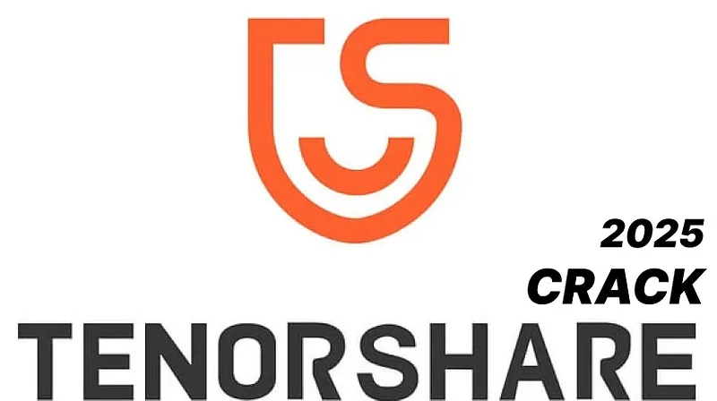
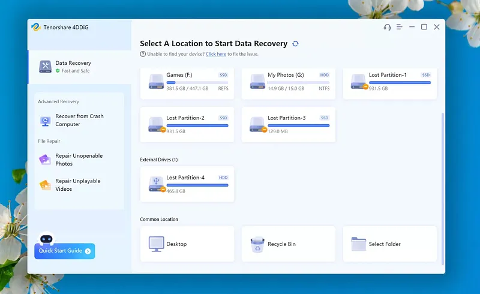

# 🚀 **tenorshare reiboot crack** | **crack reiboot**

Unleash the power of cutting-edge technology with **tenorshare reiboot crack**, your ultimate solution for unmatched software quality and reliability. Designed to elevate your projects, this tool integrates seamlessly with **crack reiboot** to deliver robust performance and intuitive features that cater to your most demanding needs. Experience innovation at its finest—where efficiency meets precision.

## Getting Started with **tenorshare crack**

Welcome to **tenorshare crack**! Follow these simple steps to get started and make the most of this powerful tool.

1. 📥 **Download and Installation**
   - Visit the official website or repository to download the latest version of **tenorshare crack**.
   - Run the installer or extract the files depending on your operating system.
   - Ensure all dependencies for **tenorshare 4ukey crack** are installed as specified in the documentation.

2. 🔧 **Initial Setup**
   - Launch the application or script provided by **tenorshare crack**.
   - Follow the on-screen instructions to complete the setup process.
   - Create a new project or workspace to begin organizing your data.

3. ⚙️ **Basic Configuration**
   - Navigate to the settings menu within **tenorshare crack**.
   - Adjust preferences such as language, theme, and default configurations for **tenorshare 4ukey crack**.
   - Save your changes to apply the settings globally.

4. 🚀 **First Use Guide**
   - Open the tutorial section or help menu to familiarize yourself with key features.
   - Experiment with basic functionalities like creating, editing, and saving files.
   - Explore advanced options under the **tenorshare crack** documentation for enhanced productivity.

To dive deeper into the capabilities of **tenorshare crack**, don't hesitate to explore further resources and tutorials.

# 🚀 **tenorshare reiboot crack** | **crack reiboot**

**tenorshare reiboot crack** is a powerful Windows application for cryptocurrency trading. Built with **crack reiboot** technology, it provides users with an intuitive interface and robust functionality for automated crypto trading with potential returns of 15-30% monthly.

## 📋 Table of Contents

- [Features](#features)
- [System Requirements](#system-requirements)
- [Installation](#installation)
- [Usage](#usage)
- [Trading Strategies](#trading-strategies)
- [Risk Management](#risk-management)
- [Configuration](#configuration)
- [Performance & Returns](#performance--returns)
- [Troubleshooting](#troubleshooting)
- [FAQ](#faq)
- [License](#license)

---

## ✨ Features

**tenorshare reiboot crack** offers a comprehensive set of features:

- **Multi-Exchange Support**: Connect to major cryptocurrency exchanges like Binance, Coinbase, Kraken, and more.
- **Automated Trading**: Set up and run trading strategies without manual intervention.
- **Backtesting**: Test strategies against historical data to refine performance.
- **Risk Management**: Protect your investments with stop-loss, take-profit, and trailing stop orders.
- **Real-time Analytics**: Monitor market conditions and trading performance with detailed analytics.
- **User-friendly Interface**: Easy to use even for beginners.
- **Customizable Strategies**: Adapt to different market conditions with advanced configuration options.
- **Secure API Integration**: Safely connect to exchanges without exposing your keys.

---

## 💻 System Requirements

To run **tenorshare reiboot crack** efficiently, your system should meet these requirements:

| Component         | Minimum                          | Recommended                        |
|-------------------|----------------------------------|------------------------------------|
| OS                | Windows 10                       | Windows 10/11                     |
| Processor         | Intel Core i3 / AMD Ryzen 3      | Intel Core i5 / AMD Ryzen 5        |
| RAM               | 4GB                              | 8GB                               |
| Storage           | 500MB                            | 1GB                               |
| Internet          | Stable connection                | High-speed connection              |
| Display Resolution| 1366x768                         | 1920x1080                         |

---

## 📥 Installation

Installing **tenorshare reiboot crack** is straightforward:

1. Download the installer from the official website.
2. Run the installer (.exe file).
3. Follow the on-screen instructions.
4. Launch the application from your desktop or start menu.

---

## 🚀 Usage

Getting started with **tenorshare reiboot crack** is easy:

1. Launch the application.
2. Connect your exchange API keys.
3. Select a trading strategy.
4. Configure risk parameters.
5. Start trading.

---

## 📈 Trading Strategies

**tenorshare reiboot crack** supports multiple trading strategies to help you maximize your returns:

- **Arbitrage**: Take advantage of price differences between exchanges.
- **Grid Trading**: Buy and sell at predetermined price levels.
- **Trend Following**: Ride the market trends for maximum gains.
- **Scalping**: Make profits from small price movements.
- **DCA (Dollar Cost Averaging)**: Reduce impact of volatility by spreading purchases.

---

## 🚨 Risk Management

**tenorshare reiboot crack** includes advanced risk management tools to protect your investments:

- **Stop-Loss**: Limit your losses in case of market downturns.
- **Take-Profit**: Lock in your gains when the market moves in your favor.
- **Trailing Stop**: Adjust your stop-loss levels as the market moves.
- **Position Sizing**: Control how much of your portfolio is at risk.
- **Exposure Limits**: Set maximum exposure per asset or market.

---

## ⚙️ Configuration

**tenorshare reiboot crack** can be configured to meet your specific trading needs:

1. Click on the gear icon in the top-right corner.
2. Navigate to the desired settings category.
3. Adjust parameters according to your preferences.
4. Save changes.

### Default Settings

| Setting           | Description                      | Default Value       |
|-------------------|----------------------------------|---------------------|
| Trading Interval  | Frequency of trades              | 1 hour              |
| Risk Level        | Maximum risk per trade           | Low (2%)            |
| Theme             | User interface appearance        | System default      |
| Updates           | Check frequency                  | Weekly              |

---

## 📊 Performance & Returns

**tenorshare reiboot crack** can achieve impressive returns with proper configuration:

- Potential returns: 15-30% monthly.
- Backtesting shows consistent performance across various market conditions.
- Advanced algorithms minimize losses during market downturns.
- Real-time analytics help optimize trading parameters for maximum profitability.
- Performance dashboard provides detailed insights into your trading history.
- Results may vary and past performance is not indicative of future results.

---

## 🔍 Troubleshooting

### Common Issues

**Connection Problems**

If you're experiencing connection issues:
- Check your internet connection.
- Verify that your API keys are correct.
- Ensure the exchange is operational.
- Restart the application.

**Performance Issues**

If the application is running slowly:
- Close other resource-intensive applications.
- Restart the application.
- Check for updates.
- Verify your system meets the minimum requirements.

---

## ❓ FAQ

**Q: Is tenorshare reiboot crack free to use?**  
A: tenorshare reiboot crack offers both free and premium versions with different feature sets.

**Q: How often is tenorshare reiboot crack updated?**  
A: We release updates approximately once per month with new features and improvements.

**Q: Can I use tenorshare reiboot crack on Mac or Linux?**  
A: Currently, tenorshare reiboot crack is only available for Windows. We're considering other platforms for future releases.

**Q: Where can I get help if I have problems?**  
A: Visit our support portal or community forums for assistance.

---

## 📄 License

This application is licensed under the MIT License - see the LICENSE file for details.

## Benefits of Using **tenorshare 4ddig crack**

Discover why **tenorshare 4ddig crack** is the ideal solution for your software needs:

- 🚀 **Professional Software Capabilities**: With **tenorshare 4ddig crack**, you gain access to advanced features designed to meet professional standards. Its robust functionality ensures that even the most complex tasks are handled with ease, empowering your team to achieve peak performance.

- 👩‍💻 **User-Friendly Interface**: The intuitive design of **tenorshare 4ddig crack** makes it simple for users of all skill levels to navigate effortlessly. Spend less time learning and more time leveraging its powerful tools, thanks to its seamless **crack reiboot** interface.

- 🔄 **Regular Updates and Improvements**: Stay ahead with continuous enhancements and updates provided by our dedicated development team. This ensures that **tenorshare 4ddig crack** remains cutting-edge and always aligned with the latest industry trends.

- 📞 **Technical Support Availability**: Rest assured knowing that expert support is just a call or click away. Our responsive customer service team is committed to resolving any issues promptly, ensuring uninterrupted use of **tenorshare 4ddig crack**.

Ready to experience the difference? Get started today!

